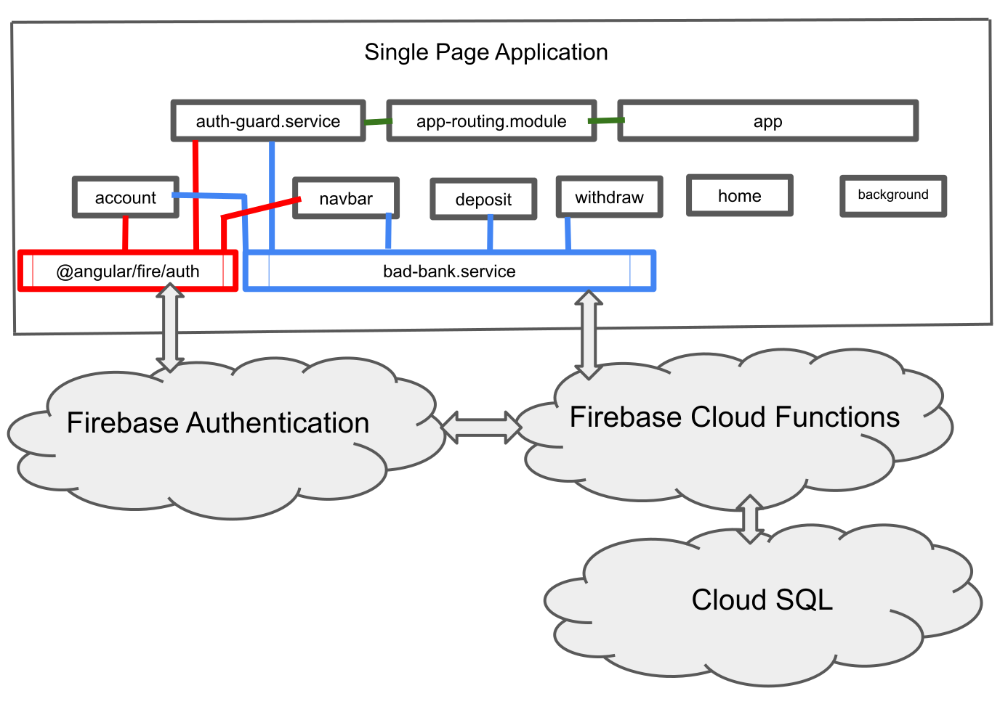

# MIT xPRO Professional Certificate in Full Stack Engineering 
## Bad Bank Capstone Project November 2021

### Introduction
This the front-end part of a Bad Bank project completed in fulfillment of the MIT xPRO Professional Certificate Full Stack Engineering course. It uses the following component architecture. 



### Develop

After cloning this repo, install the necessary dependancies by running `npm i --save` inside the project folder. Create an `src/environments` folder and create files `enviornment.ts` and `environment.prod.ts`. Configure these files with your Firebase Authentication project settings from the Firebase console and the URLs where the back-end cloud functions are hosted. 

`enviornment.ts`

```
export const environment = {
  production: false,
  firebase:{
    apiKey: "your apiKey",
    authDomain: "your authDomain",
    authDomain: "your authDomain",
    storageBucket: "your storageBucket",
    messagingSenderId: "your messagingSenderId",
    appId: "your appId",
    measurementId: "your measurementId"
  },
  url:{
    createUserAccount_Authenticated:`https://<"cloud functions url">/createUserAccount_Authenticated`,
    getUserAccount_Authenticated:`https://<"cloud functions url">/getUserAccount_Authenticated`,
    deposit_Authenticated:`https://<"cloud functions url">/deposit_Authenticated`,
    withdraw_Authenticated:`https://<"cloud functions url">/withdraw_Authenticated`,
    createGoogleUserAccount_Authenticated:`https://<"cloud functions url">/createGoogleUserAccount_Authenticated`
  }
};
```

`environment.prod.ts` is similar except that the production is set to true. 

Run `ng serve` for a dev server. The app will automatically reload if you change any of the source files.

### Build

Run `ng build` to build the project. The build artifacts will be stored in the `dist/` directory.

### Other information

This project was generated with [Angular CLI](https://github.com/angular/angular-cli) version 12.1.3 and is deployed at [https://mit-xpro-319116.web.app/Ben-GrossFullStackBankingApplication](https://mit-xpro-319116.web.app/). 

### Contact 
[Ben Gross's LinkedIN](https://www.linkedin.com/in/nutritionengineering/) / Email: ben@nutrition.engineering
