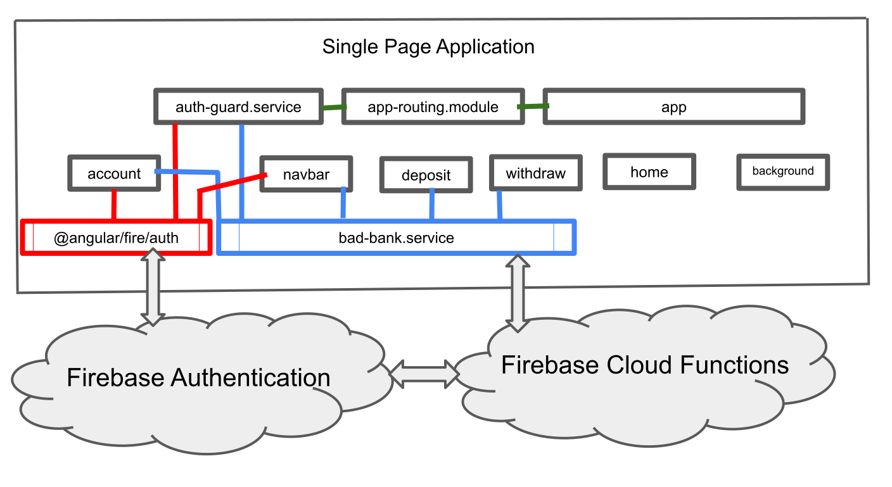

# MIT xPRO Professional Certificate in Full Stack Engineering 
## Bad Bank Capstone Project November 2021

### Introduction
This the front-end part of a Bad Bank project completed in fulfillment of the MIT xPRO Professional Certificate Full Stack Engineering course. It uses the following component architecture. 

### Develop

After cloning this repo, install the necessary dependancies by running `npm i --save` inside the project folder. Run `ng serve` for a dev server. The app will automatically reload if you change any of the source files.

### Build

Run `ng build` to build the project. The build artifacts will be stored in the `dist/` directory.

### Other information

This project was generated with [Angular CLI](https://github.com/angular/angular-cli) version 12.1.3. 
